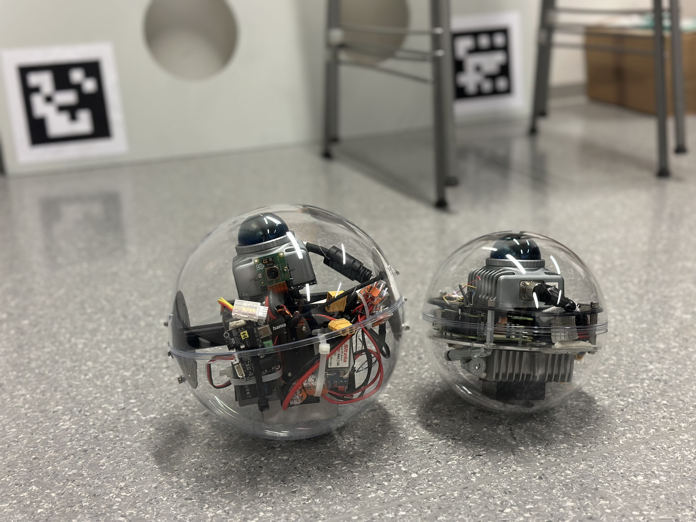

# 3D Mapping Sphere ROS2



## Project Overview

This repository contains the complete software stack for two custom-built spherical robots designed for autonomous 3D mapping and navigation. The system is built on **ROS2 Jazzy** running on **Ubuntu 24.04 ARM** platforms, integrating advanced LiDAR-Inertial Odometry (LIO) algorithms with spherical robot control systems.

### Key Features

- **Dual Spherical Robot System**: Two independently operating spherical mapping robots
- **Advanced SLAM Algorithms**: Integration of FAST-LIVO2, Direct LiDAR Inertial Odometry (DLIO), and FAST-LIO
- **Control Strategy Applied for (Actuated Sphere)**: Applied PID control on the actuated sphere for balanced motion
- **Real-time 3D Mapping**: High-precision point cloud generation and visualization
- **ROS2 Native**: Built for ROS2 Jazzy with full compatibility

## System Architecture

```
3D_Mapping_Sphere_ROS2/
├── mapping_ws/          # Main mapping workspace
│   └── src/
│       ├── FAST-LIVO2-ROS2-MID360-Fisheye/    # Advanced LIVO(LIO Mode) algorithm
│       ├── direct_lidar_inertial_odometry/      # DLIO implementation
│       ├── Livox-SDK2/                          # Livox LiDAR SDK
│       ├── rpg_vikit_ros2_fisheye/             # Vision processing
│       └── bno_imu/                            # IMU sensor package
├── Actuators_ws/        # Robot control workspace
│   └── src/
│       ├── servo_pwm_node/                     # Servo control
│       ├── logitech_controller/                # Input device handling
│       ├── waveshare_servo/                    # Hardware interface
│       └── khonsu/                             # Robot bootup package
├── Manuscript/          # Research documentation
├── Thesis/             # Academic thesis material
└── README.md
```

## Hardware Requirements

### Primary Components

- **LiDAR**: Livox MID-360 360° LiDAR sensor (The mapping system can support other LiDAR types)
- **IMU**: BNO085 and internal IMU of Livox MID-360
- **Actuators (Actuated Variant)**: Waveshare smart Servo (ST-3215) servo motors for spherical locomotion and single PWM servo
- **Controller**: Logitech gamepad for manual control
- **Compute**: Raspberry Pi 5 (Ubuntu 24.04)

### Minimum System Requirements

- **OS**: Ubuntu 24.04 ARM64
- **ROS**: ROS2 Jazzy
- **RAM**: 8GB minimum, 16GB recommended
- **Storage**: 64GB minimum and SSD is highly recommended
- **Network**: WiFi/Ethernet

## Installation

### Prerequisites

1. **Install ROS2 Jazzy** on Ubuntu 24.04:

   Follow the [official ROS2 Jazzy installation guide for Ubuntu](https://docs.ros.org/en/jazzy/Installation/Ubuntu-Install-Debians.html)

2. **Install dependencies**:

```bash
sudo apt install -y \
    cmake \
    libeigen3-dev \
    libpcl-dev \
    libopencv-dev \
    libfmt-dev \
    libboost-all-dev \
    python3-colcon-common-extensions
```

3. **Install Sophus** (required for FAST-LIVO2):

```bash
cd ~
git clone https://github.com/strasdat/Sophus.git -b 1.22.10
cd Sophus
mkdir build && cd build && cmake ..
make
sudo make install
```

### Building the Project

1. **Clone and setup workspace**:

```bash
git clone https://github.com/your-username/3D_Mapping_Sphere_ROS2.git
cd 3D_Mapping_Sphere_ROS2
```

2. **Edit the configuration files of each package in mapping workspace with correct IMU and LiDAR topics**
3. **Build mapping workspace**:

```bash
cd mapping_ws
source /opt/ros/jazzy/setup.bash
colcon build --symlink-install
source install/setup.bash
```

3. **Build actuators workspace**:

```bash
cd ../Actuators_ws
source /opt/ros/jazzy/setup.bash
colcon build --symlink-install
source install/setup.bash
```

## Quick Start

### 1. Launch LiDAR Driver

```bash
# Terminal 1 - Start Livox MID-360
source mapping_ws/install/setup.bash
ros2 launch livox_ros_driver2 msg_MID360_launch.py xfer_format:=0
```

### 2. Start SLAM Algorithm

Choose one of the following mapping algorithms:

**Option A: FAST-LIVO2**

```bash
# Terminal 2 - FAST-LIVO2 (LIO Mode)
source mapping_ws/install/setup.bash
ros2 launch fast_livo mapping_aviz_metacamedu.launch.py use_rviz:=true
```

**Option B: Direct LiDAR Inertial Odometry**

```bash
# Terminal 2 - DLIO
source mapping_ws/install/setup.bash
ros2 launch direct_lidar_inertial_odometry dlio.launch.py \
    rviz:=true \
    pointcloud_topic:=/livox/points \
    imu_topic:=/livox/imu
```

### 3. Launch Robot Control System (Actuated system)
I recommend killing the program after the 1st Run then run it again for the pendulum mechanism to work.
```bash
# Terminal 3 - Robot actuation (run as root for GPIO access)
sudo bash -c "source /opt/ros/jazzy/setup.bash && source install/setup.bash && export ROS_DOMAIN_ID=1 && ros2 launch khonsu movingNodes.launch.py"
```

## Key ROS2 Topics

### Sensor Data

- `/livox/points` - LiDAR point cloud data
- `/livox/imu` - IMU sensor data

### SLAM Outputs

- `/cloud_registered` - Registered point cloud map (FAST-LIO2 and FAST-LIVO2)
- `/dlio/odom_node/pointcloud/deskewed` - Registered point cloud map (DLIO)
- `/odometry` - Robot pose estimation (FAST-LIO2 and FAST-LIVO2)
- `/path` - Trajectory visualization

### Robot Control

- `/controller` - Gamepad input after mapping
- `/joy` - raw joystick input

## Configuration

### LiDAR Configuration

Edit [`mapping_ws/src/Livox-SDK2/samples/livox_lidar_quick_start/mid360_config.json`](mapping_ws/src/Livox-SDK2/samples/livox_lidar_quick_start/mid360_config.json):

```json
{
  "MID360": {
    "lidar_net_info": {
      "cmd_data_port": 56100,
      "push_msg_port": 56200,
      "point_data_port": 56300,
      "imu_data_port": 56400,
      "log_data_port": 56500
    },
    "host_net_info": [
      {
        "lidar_ip": ["192.168.1.12"],
        "host_ip": "192.168.1.5"
      }
    ]
  }
}
```

### FAST-LIVO2 Parameters

Key parameters in [`mapping_ws/src/FAST-LIVO2-ROS2-MID360-Fisheye/config/`](mapping_ws/src/FAST-LIVO2-ROS2-MID360-Fisheye/config/):

- LiDAR extrinsic calibration
- IMU noise parameters
- Mapping resolution settings
- etc...

### FAST-LIO2 Parameters

### DLIO Parameters

## Documentation

- **[FAST-LIO2 Repo ROS2](https://github.com/Ericsii/FAST_LIO_ROS2)**
- **[FAST-LIVO2 Repo ROS2](https://github.com/Rhymer-Lcy/FAST-LIVO2-ROS2-MID360-Fisheye)**
- **[DLIO Repo ROS2](https://github.com/vectr-ucla/direct_lidar_inertial_odometry/tree/feature/ros2)**
- **[Livox SDK2 Documentation](mapping_ws/src/Livox-SDK2/README.md)** - LiDAR integration
- **[Thesis Document](Thesis/)** - Complete technical documentation

## Research Impact

This work contributes to:

- **Actuated Spherical Robot with SLAM**: Novel Sphere with Actuation and control strategies while doing mobile SLAM
- **High Accuracy Spherical SLAM**: Real-time mapping with high accuracy that paves the way for autonomous driving

## Contributing

We welcome contributions! Please:

1. **Fork** the repository
2. **Create** a feature branch (`git checkout -b feature/Example`)
3. **Commit** changes (`git commit -m 'Add Example'`)
4. **Push** to branch (`git push origin feature/Example`)
5. **Open** a Pull Request

## Project Status

**Active Development** - This project is actively maintained and developed.

### Current Version: v1.0.0

---

For questions, issues, or collaborations, please [open an issue](https://github.com/your-username/3D_Mapping_Sphere_ROS2/issues) or contact the development team.
